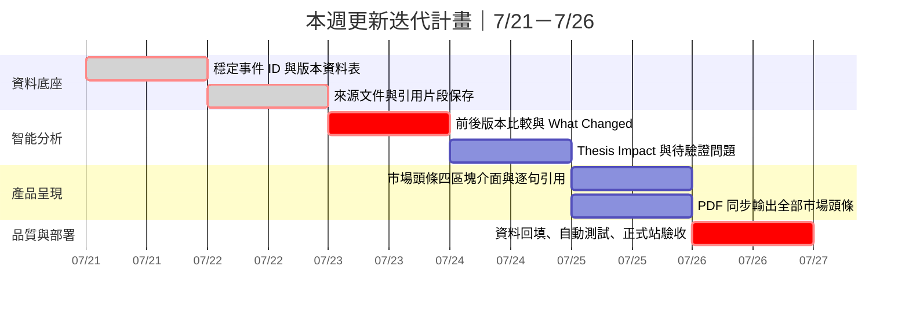

# 7/21–7/26｜可稽核投資晨報迭代任務

> Canonical task（正式任務）：[GitHub Issue #12](https://github.com/kk1030-bit/analystarena-daily-intelligence/issues/12)<br>
> Execution branch（執行分支）：`agent/auditable-brief-0721-0726`<br>
> Period（期間）：2026-07-21 至 2026-07-26<br>
> Current status（目前狀態）：7/22 已完成 Render migration、真實重採集、人工審核、正式發布、PDF 與歷史歸檔驗收；下一項為 7/23 What Changed。

## 使用方式

後續開發者或 Agent 在開始本週任務前，必須先讀取本文件與 Issue #12。對話摘要、記憶或臨時說明不得取代這兩個正式來源。

每完成一天的項目，必須同步更新：

1. 本文件的任務勾選與交付紀錄。
2. Issue #12 的對應勾選項。
3. PR、commit、migration、測試與 Render 驗收證據。

缺少上述證據時，不得把任務標記為完成。

## 本週目標

把目前的「摘要型 Daily Brief」升級成「每個判斷都能追到證據、知道與上一版有何不同」的可稽核投資晨報。



## 每日更新內容

| 日期 | 更新方向 | 當天交付結果 | 狀態 |
|---|---|---|---|
| 7/21 | 資料庫底座 | 建立穩定事件 ID、事件版本、前一版本關聯；每次實際觸發的十分鐘更新不再覆蓋舊資料 | 已完成 |
| 7/22 | 來源證據鏈 | 同時保存原始發布時間、採集時間、網址、內容雜湊、引用片段及可驗證定位 | 已完成（正式站驗收） |
| 7/23 | What Changed | 自動比較上一版本，標記首次出現、新增證據、數字變動、方向與排名變化 | 待執行 |
| 7/24 | 投資判斷 | 結構化記錄營收／獲利／估值／風險影響、利好與利空標的、原判斷與新判斷 | 待執行 |
| 7/25 | 網頁及 PDF | 每則市場頭條呈現「新增資訊、來源、判斷影響、待驗證問題」四區塊；PDF 包含全部頭條 | 待執行 |
| 7/26 | 驗收部署 | 測試十分鐘更新、歷史版本、來源連結、PDF、人工審核及 Render 正式站 | 待執行 |

## 執行清單

- [x] **7/21｜穩定事件 ID 與版本資料表**
  - 穩定來源文件 ID、永久事件 ID、事件 alias。
  - 來源版本、事件版本、採集批次與不可變日報快照。
  - `previous_version_id` 與 `previous_snapshot_id` 版本鏈。
  - 幂等批次、資料庫鎖、失敗回滾、發布凍結及舊資料回填。
  - 證據：[PR #11](https://github.com/kk1030-bit/analystarena-daily-intelligence/pull/11)、功能提交 `ba904c6`、正式合併 `a0e6022`。
  - 正式站驗證：PostgreSQL 快照序號 2，快照 `0e11329d-655d-4f25-9906-296ac69a9a62` 已連到上一份快照。
- [x] **7/22｜來源文件與引用片段保存**
  - [x] 為每條標題、摘要、重要資訊、市場影響及方向依據建立 claim 與 evidence record，不再只保存事件層來源清單。
  - [x] 分開保存原始發布時間、採集時間、原始時間文字、標準化網址、來源原文采集物、UTF-8 位元組數及 SHA-256。
  - [x] RSS／Atom、Reddit 及 X 的引用必須逐欄位回查原始采集物；引用、來源 ID、貼文 ID 或時間不一致時整批拒絕寫入。
  - [x] HTML 只接受可由采集物證明的精確 TextQuote；沒有結構化 DOM 證據時拒絕聲稱 CSS／段落位置。
  - [x] PDF 必須保存逐頁文字采集物，頁碼、頁內偏移及引用文字全部吻合才可使用；否則標記定位不可用。
  - [x] 引用內容改變時建立新 evidence version；A→B→A 仍保留三個依時間排序的不可變版本。
  - [x] 事件版本、完整證據集合、claim 引用、快照來源觀察及排名投影以複合外鍵綁定，發布前再與 PostgreSQL 權威資料逐欄核對。
  - [x] AI 選到有效引用不等於語義成立；AI claim 一律待確認，審核台新增逐條人工語義確認，編輯內容會清除確認。
  - [x] 歷史資料只回填為 `legacy_unverified`，不捏造原文、發布時間、段落或頁碼。
  - [x] 功能提交：`03aa498`、`18e41f6`、`e51362c`；Migration：`db/migrations/20260722_source_evidence_v2.sql`、`db/migrations/20260722_source_observation_evidence_time.sql`、`db/migrations/20260722_zz_snapshot_claim_presentations.sql`。
  - [x] Render 正式資料庫 migration、真實來源重採集、人工審核、正式發布、PDF 與歷史歸檔驗收。
- [ ] **7/23｜前後版本比較與 What Changed**
  - 分辨首次發現、新增／移除證據、數字變動、方向變化、排名變化。
  - 沒有上一版本時只顯示「首次發現」。
  - 保存上一版、當前版、改變原因與比較演算法版本。
- [ ] **7/24｜Thesis Impact 與待驗證問題**
  - 結構化保存營收、獲利、估值、風險與催化劑影響。
  - 保存原判斷、新判斷、利好／利空標的與影響機制。
  - 每個待驗證問題包含驗證條件、期限、狀態與應查來源。
- [ ] **7/25｜市場頭條四區塊介面與 PDF**
  - 網頁每則事件顯示「新增資訊、來源、判斷影響、待驗證問題」。
  - 每條重要資訊可由引用編號打開原始網址、引用片段與位置。
  - PDF 同步輸出全部市場頭條及同一套引用、判斷與待驗證資料。
  - 現有「全部市場頭條 PDF」只是基礎；四區塊與逐句證據完成前，本項仍不得勾選。
- [ ] **7/26｜資料回填、自動測試與正式站驗收**
  - 回填既有來源與事件時不捏造引用、位置或昨日差異。
  - 驗證十分鐘更新、歷史版本、來源連結、PDF、人工審核與發布凍結。
  - 在全新 PostgreSQL 與正式 Render 資料庫都驗證 migration。

## 本週完成後的驗收標準

- [x] 每條「重要資訊」至少綁定一個證據來源。
- [ ] 點擊引用編號可以看到原始來源、引用片段與位置。
- [ ] 發布時間與採集時間分開顯示，統一為北京時間並精確到分鐘。
- [ ] 首次出現的事件明確標記「首次發現」，不捏造昨日差異。
- [ ] 已存在事件能顯示「上一版 → 當前版本 → 改變原因」。
- [ ] 利好、利空標的及影響機制都會寫入網站與 PDF。
- [ ] 每個待驗證問題包含驗證條件、期限及狀態。
- [x] 缺少證據的高影響判斷不能直接發布，只能降級為「待確認」。

## 不可跳過的品質規則

1. 先完成版本資料與證據鏈，再開發 What Changed、AI 判斷、介面及 PDF。
2. 每個判斷必須指向具體 evidence ID；只有事件層來源清單不算逐句證據。
3. 沒有上一版本時禁止產生「增加、下降、轉多、轉空」等差異敘述。
4. 原始發布時間與採集時間使用 UTC `TIMESTAMPTZ` 保存；只在顯示層轉成北京時間，精確到分鐘。
5. 缺少引用片段或位置的高影響判斷只能是「待確認」，不得通過發布閘門。
6. 人工修改必須建立新版本並保留修改前內容、操作者與時間。
7. 排名、時效分與版面文字不得誤觸發新的事件內容版本。

## 每日交付紀錄模板

完成後在本節追加，不得只修改上方勾選框。

```text
日期：YYYY-MM-DD
狀態：完成／部分完成／阻塞
PR：
Commit：
Migration：
自動測試：
正式站驗證：
已知限制：
下一項：
```

### 2026-07-21

- 狀態：完成並正式部署。
- PR：[PR #11](https://github.com/kk1030-bit/analystarena-daily-intelligence/pull/11)
- Commit：`ba904c6`，正式合併 `a0e6022`。
- Migration：`db/migrations/20260721_event_history.sql`。
- 自動測試：TypeScript、ESLint、日報回歸、Next.js build、PostgreSQL 17 並發與不可變歷史測試通過。
- 正式站驗證：匿名強制刷新 HTTP 200、無 fallback、PostgreSQL 成功寫入不可變快照序號 2。
- 已知限制：真正的背景十分鐘排程尚未建立；目前保證每次實際觸發的成功批次留存。
- 下一項：7/22 來源文件與引用片段保存。

### 2026-07-22

- 狀態：完成並正式部署；真實日報已通過證據閘門、人工審核、發布、PDF 與歸檔驗收。
- PR：[PR #13](https://github.com/kk1030-bit/analystarena-daily-intelligence/pull/13)。
- Commit：`03aa498`（Add auditable source evidence chain）、`18e41f6`（Expose publication authority blockers）、`e51362c`（Normalize snapshot claim presentation authority）。
- Migration：`db/migrations/20260722_source_evidence_v2.sql`、`db/migrations/20260722_source_observation_evidence_time.sql`、`db/migrations/20260722_zz_snapshot_claim_presentations.sql`；最後一項把事件版本的證據斷言與不可變日報快照的翻譯展示文字分開保存，並由快照 payload 幂等回填。
- 資料模型：新增來源版本 provenance、每次採集 observation、evidence item/version、event-version evidence、claim/evidence link 及 snapshot source observation；所有歷史表禁止更新或刪除。
- 精度規則：原始時間文字必須嚴格解析並與標準時間一致；模糊時區、無時區及不存在日期不當作發布時間。引用必須存在於來源采集物，且 feed 欄位、Reddit post ID、X status ID、HTML TextQuote 或 PDF 頁碼／偏移必須可驗證。
- 發布規則：頁面內容、事件版本、證據、來源、快照排名與股票影響均須匹配 PostgreSQL 權威資料；AI 判斷未逐條人工語義確認時不可發布，任何未審核股票影響也不可發布。
- 權威不一致修復：首次正式發布回傳 9 個 `CLAIM_AUTHORITY_MISMATCH`，精確對應排名 4–6 的 `title`、`summary`、`important_information:0`。根因是相同證據事件版本正確復用，但舊 `event_claims` 展示翻譯被拿來與新快照翻譯比較；修復後由 43 條不可變 snapshot claim presentation 管理 `statement`／`language`／`ordinal`，而原文、SHA-256、審核狀態、生成器與 57 條引用仍由事件版本逐欄核驗，未繞過證據閘門。
- 真實採集：[GitHub Actions Run 29917776918](https://github.com/kk1030-bit/analystarena-daily-intelligence/actions/runs/29917776918) 成功；94 則候選、73 個合併事件、8 則頭條，保存 15 份來源文件、30 份證據、43 條 claim 與 57 條 citation。
- 自動測試：`test:evidence:postgres`、`test:events:postgres` 在隔離 PostgreSQL 18 通過；完整 `test:brief`、TypeScript、ESLint、Next.js production build 與 `git diff --check` 全數通過。新增回歸覆蓋純翻譯不製造事件版本、展示文字／語言篡改阻擋、原文 hash／審核狀態／引用仍嚴格阻擋，以及 migration 完整回填與重跑幂等。
- 正式站驗證：Render deploy `dep-d9gcs458nd3s73euafog`（commit `e51362c`）為 Live；日報 `4d8bb0a7-67d3-4bee-8cb4-83ab2298091c` 狀態為 `published`，快照 `367ea385-796f-4b03-9133-c6503fafe63b`，8 則頭條、5/5 股票影響已批准、待審 0。[PDF](https://analystarena-daily-intelligence.onrender.com/api/briefs/4d8bb0a7-67d3-4bee-8cb4-83ab2298091c/pdf) 回傳 HTTP 200 `application/pdf`，19 頁無空白頁、缺頁碼、越界文字或壞占位符，含 29 個可點擊來源連結；[歷史歸檔](https://analystarena-daily-intelligence.onrender.com/archive) 已顯示本日報。
- 已知限制：Reddit RSS 本次受 429 限流且 Playwright 未取得結果；X 未設定原生 `X_AUTH_TOKEN`，本次由新聞索引回退取得 16 條線索。限制已明確保留，不把回退資料冒充原生平台資料。HTML／PDF 已定義 fail-closed 證據格式，但真正的詳情頁與 PDF 采集器仍屬後續工作；逐句引用投資人介面安排於 7/25。
- 下一項：7/23 前後版本比較與 What Changed。
