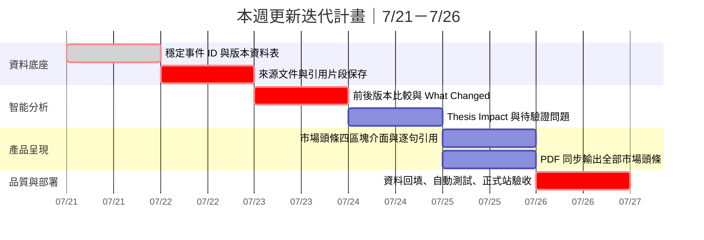

# 7/21–7/26｜可稽核投資晨報迭代任務

> Canonical task（正式任務）：[GitHub Issue #12](https://github.com/kk1030-bit/analystarena-daily-intelligence/issues/12)<br>
> Execution branch（執行分支）：`agent/auditable-brief-0721-0726`<br>
> Period（期間）：2026-07-21 至 2026-07-26<br>
> Current status（目前狀態）：7/21 已完成並部署；下一項為 7/22 來源證據鏈。

## 使用方式

後續開發者或 Agent 在開始本週任務前，必須先讀取本文件與 Issue #12。對話摘要、記憶或臨時說明不得取代這兩個正式來源。

每完成一天的項目，必須同步更新：

1. 本文件的任務勾選與交付紀錄。
2. Issue #12 的對應勾選項。
3. PR、commit、migration、測試與 Render 驗收證據。

缺少上述證據時，不得把任務標記為完成。

## 本週目標

把目前的「摘要型 Daily Brief」升級成「每個判斷都能追到證據、知道與上一版有何不同」的可稽核投資晨報。



## 每日更新內容

| 日期 | 更新方向 | 當天交付結果 | 狀態 |
|---|---|---|---|
| 7/21 | 資料庫底座 | 建立穩定事件 ID、事件版本、前一版本關聯；每次實際觸發的十分鐘更新不再覆蓋舊資料 | 已完成 |
| 7/22 | 來源證據鏈 | 同時保存原始發布時間、採集時間、網址、內容雜湊、引用片段及段落／頁碼 | 待執行 |
| 7/23 | What Changed | 自動比較上一版本，標記首次出現、新增證據、數字變動、方向與排名變化 | 待執行 |
| 7/24 | 投資判斷 | 結構化記錄營收／獲利／估值／風險影響、利好與利空標的、原判斷與新判斷 | 待執行 |
| 7/25 | 網頁及 PDF | 每則市場頭條呈現「新增資訊、來源、判斷影響、待驗證問題」四區塊；PDF 包含全部頭條 | 待執行 |
| 7/26 | 驗收部署 | 測試十分鐘更新、歷史版本、來源連結、PDF、人工審核及 Render 正式站 | 待執行 |

## 執行清單

- [x] **7/21｜穩定事件 ID 與版本資料表**
  - 穩定來源文件 ID、永久事件 ID、事件 alias。
  - 來源版本、事件版本、採集批次與不可變日報快照。
  - `previous_version_id` 與 `previous_snapshot_id` 版本鏈。
  - 幂等批次、資料庫鎖、失敗回滾、發布凍結及舊資料回填。
  - 證據：[PR #11](https://github.com/kk1030-bit/analystarena-daily-intelligence/pull/11)、功能提交 `ba904c6`、正式合併 `a0e6022`。
  - 正式站驗證：PostgreSQL 快照序號 2，快照 `0e11329d-655d-4f25-9906-296ac69a9a62` 已連到上一份快照。
- [ ] **7/22｜來源文件與引用片段保存**
  - 為每條重要資訊建立 evidence record，不只在事件層保存一組來源。
  - 保存原文引用片段、原始發布時間、採集時間、標準化網址及內容雜湊。
  - 網頁來源保存段落、CSS／文字定位或 PDF 頁碼；定位不可取得時明確記錄原因。
  - 引用內容改變時建立新 evidence version，不覆蓋舊引用。
- [ ] **7/23｜前後版本比較與 What Changed**
  - 分辨首次發現、新增／移除證據、數字變動、方向變化、排名變化。
  - 沒有上一版本時只顯示「首次發現」。
  - 保存上一版、當前版、改變原因與比較演算法版本。
- [ ] **7/24｜Thesis Impact 與待驗證問題**
  - 結構化保存營收、獲利、估值、風險與催化劑影響。
  - 保存原判斷、新判斷、利好／利空標的與影響機制。
  - 每個待驗證問題包含驗證條件、期限、狀態與應查來源。
- [ ] **7/25｜市場頭條四區塊介面與 PDF**
  - 網頁每則事件顯示「新增資訊、來源、判斷影響、待驗證問題」。
  - 每條重要資訊可由引用編號打開原始網址、引用片段與位置。
  - PDF 同步輸出全部市場頭條及同一套引用、判斷與待驗證資料。
  - 現有「全部市場頭條 PDF」只是基礎；四區塊與逐句證據完成前，本項仍不得勾選。
- [ ] **7/26｜資料回填、自動測試與正式站驗收**
  - 回填既有來源與事件時不捏造引用、位置或昨日差異。
  - 驗證十分鐘更新、歷史版本、來源連結、PDF、人工審核與發布凍結。
  - 在全新 PostgreSQL 與正式 Render 資料庫都驗證 migration。

## 本週完成後的驗收標準

- [ ] 每條「重要資訊」至少綁定一個證據來源。
- [ ] 點擊引用編號可以看到原始來源、引用片段與位置。
- [ ] 發布時間與採集時間分開顯示，統一為北京時間並精確到分鐘。
- [ ] 首次出現的事件明確標記「首次發現」，不捏造昨日差異。
- [ ] 已存在事件能顯示「上一版 → 當前版本 → 改變原因」。
- [ ] 利好、利空標的及影響機制都會寫入網站與 PDF。
- [ ] 每個待驗證問題包含驗證條件、期限及狀態。
- [ ] 缺少證據的高影響判斷不能直接發布，只能降級為「待確認」。

## 不可跳過的品質規則

1. 先完成版本資料與證據鏈，再開發 What Changed、AI 判斷、介面及 PDF。
2. 每個判斷必須指向具體 evidence ID；只有事件層來源清單不算逐句證據。
3. 沒有上一版本時禁止產生「增加、下降、轉多、轉空」等差異敘述。
4. 原始發布時間與採集時間使用 UTC `TIMESTAMPTZ` 保存；只在顯示層轉成北京時間，精確到分鐘。
5. 缺少引用片段或位置的高影響判斷只能是「待確認」，不得通過發布閘門。
6. 人工修改必須建立新版本並保留修改前內容、操作者與時間。
7. 排名、時效分與版面文字不得誤觸發新的事件內容版本。

## 每日交付紀錄模板

完成後在本節追加，不得只修改上方勾選框。

```text
日期：YYYY-MM-DD
狀態：完成／部分完成／阻塞
PR：
Commit：
Migration：
自動測試：
正式站驗證：
已知限制：
下一項：
```

### 2026-07-21

- 狀態：完成並正式部署。
- PR：[PR #11](https://github.com/kk1030-bit/analystarena-daily-intelligence/pull/11)
- Commit：`ba904c6`，正式合併 `a0e6022`。
- Migration：`db/migrations/20260721_event_history.sql`。
- 自動測試：TypeScript、ESLint、日報回歸、Next.js build、PostgreSQL 17 並發與不可變歷史測試通過。
- 正式站驗證：匿名強制刷新 HTTP 200、無 fallback、PostgreSQL 成功寫入不可變快照序號 2。
- 已知限制：真正的背景十分鐘排程尚未建立；目前保證每次實際觸發的成功批次留存。
- 下一項：7/22 來源文件與引用片段保存。
